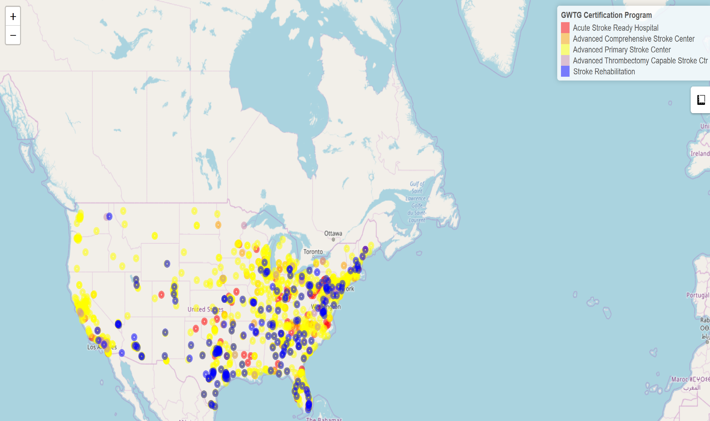

# GWTG_Stroke_Hospitals
This is a map stroke hospitals listed by Get With The Guidlines (GWTG). This is not a comprehensive list of hospitals providing stroke care in USA. The data was download from [Get With The Guidelines](https://www.qualitycheck.org/data-download/certification-data-download/) on 11/9/2019. The geocoding for the location of the hospital was performed using ggmap. The [code](./index.Rmd) is provided here. 

 is displayed using leaflet. An exploration of Rhode Island hospitals can be viewed [here](
https://gntem2.github.io/RhodeIsland)
